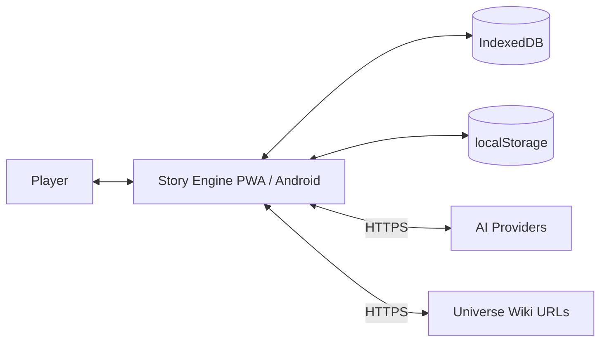
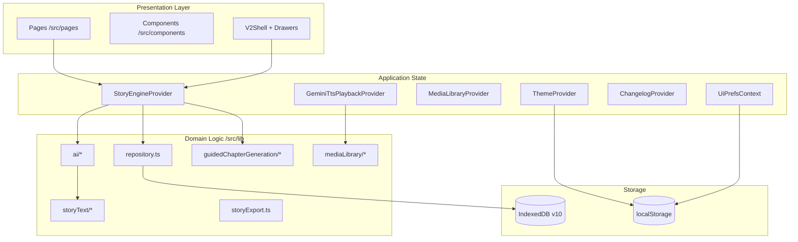
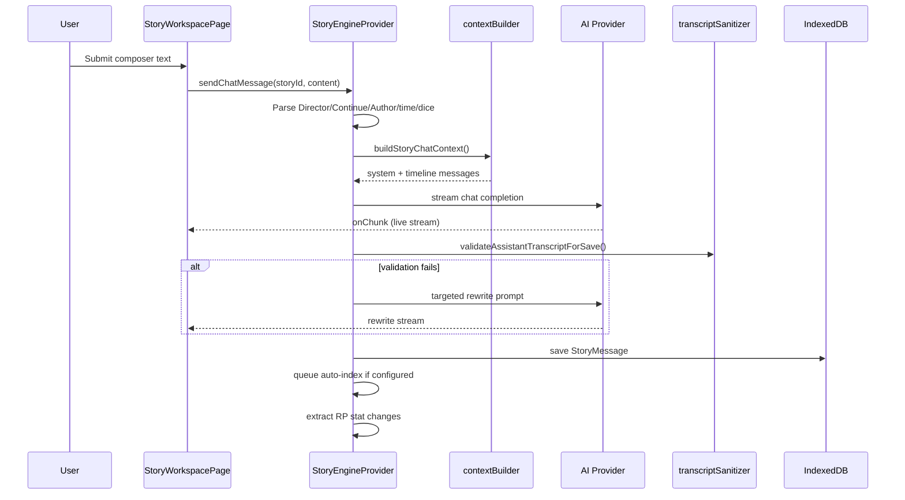
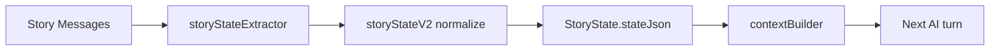
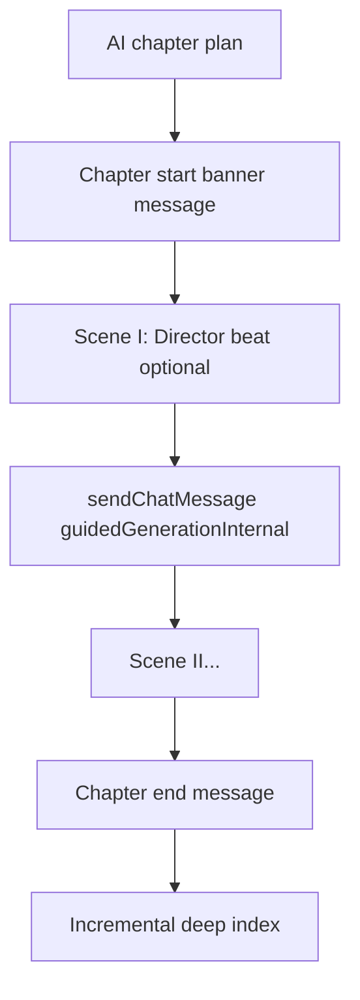

# Story Engine — Technical Architecture & Design Document (TAD)

**Document version:** 1.0  
**Application version:** 3.4.0  
**Last updated:** 2026-08-07  
**Repository:** StoryGenerator (package name: `story-engine`)  
**Canonical path:** `src/docs/STORY_ENGINE_DESIGN_DOCUMENT.md`

---

## Document purpose

This is the **single authoritative design reference** for Story Engine. It is written for:

- Developers onboarding to the codebase
- Architects evaluating extensions or integrations
- Power users who need a complete mental model of how the app works
- Future maintainers deciding where new features belong

It describes the system **as implemented** in the codebase at v3.4.0, not aspirational features.

---

## Table of contents

1. [Executive summary](#1-executive-summary)
2. [Product vision and design philosophy](#2-product-vision-and-design-philosophy)
3. [System context](#3-system-context)
4. [High-level architecture](#4-high-level-architecture)
5. [Technology stack](#5-technology-stack)
6. [Application bootstrap and shell](#6-application-bootstrap-and-shell)
7. [Routing and pages](#7-routing-and-pages)
8. [State management and providers](#8-state-management-and-providers)
9. [Data persistence](#9-data-persistence)
10. [Domain model](#10-domain-model)
11. [Story generation pipeline](#11-story-generation-pipeline)
12. [Story text format and processing](#12-story-text-format-and-processing)
13. [Director, Continue, and Author directives](#13-director-continue-and-author-directives)
14. [Validation, sanitization, and rewrite loop](#14-validation-sanitization-and-rewrite-loop)
15. [Story state, indexing, and memory](#15-story-state-indexing-and-memory)
16. [Relationships and character tracking](#16-relationships-and-character-tracking)
17. [RP mode](#17-rp-mode)
18. [Guided chapter generation](#18-guided-chapter-generation)
19. [MetaChat](#19-metachat)
20. [Audiobook and text-to-speech](#20-audiobook-and-text-to-speech)
21. [Media library](#21-media-library)
22. [AI documents and podcast generation](#22-ai-documents-and-podcast-generation)
23. [Import, export, and backup](#23-import-export-and-backup)
24. [Settings and configuration](#24-settings-and-configuration)
25. [Theming, accessibility, and UI preferences](#25-theming-accessibility-and-ui-preferences)
26. [PWA and mobile (Capacitor)](#26-pwa-and-mobile-capacitor)
27. [Background jobs and task queue](#27-background-jobs-and-task-queue)
28. [Security, privacy, and mature fiction policy](#28-security-privacy-and-mature-fiction-policy)
29. [Testing strategy](#29-testing-strategy)
30. [Build, deployment, and release](#30-build-deployment-and-release)
31. [File structure reference](#31-file-structure-reference)
32. [Key modules quick reference](#32-key-modules-quick-reference)
33. [Extension points and conventions](#33-extension-points-and-conventions)
34. [Glossary](#34-glossary)
35. [Appendix A: IndexedDB schema detail](#appendix-a-indexeddb-schema-detail)
36. [Appendix B: Background job types](#appendix-b-background-job-types)
37. [Appendix C: Story message speaker types](#appendix-c-story-message-speaker-types)
38. [Appendix D: Export format matrix](#appendix-d-export-format-matrix)

---

## 1. Executive summary

**Story Engine** is a local-first, single-user interactive fiction and roleplay application. A player creates **Universes** (canon containers), **Player Characters** (protagonist sheets), and **Stories** (play sessions). The AI generates world responses, NPC dialogue, and narration while enforcing strict **player authorship** rules: the player owns their character's thoughts, words, and voluntary actions.

All story data lives on-device in **IndexedDB**. Network access is required only for AI provider calls and optional universe wiki imports. The app ships as a **Progressive Web App (PWA)** and an **Android Capacitor** wrapper.

### What makes Story Engine distinctive

| Concern | Story Engine approach |
|---------|----------------------|
| Player agency | Post-generation validation blocks AI from writing player actions/dialogue |
| Canon | Transcript + universe imports + player sheet are authoritative |
| Memory | Deep indexing extracts structured story state, relationships, threads |
| Format | Screenplay-style transcript with speaker labels, `*action*` beats, quoted dialogue |
| Director mode | Out-of-character staging notes drive scene without appearing in prose/audiobook |
| Audiobook | Gemini TTS with per-character voices, chapter listen, full-story export |
| Long sessions | Background job queue, streaming with visible rewrite attempts, auto-indexing |

---

## 2. Product vision and design philosophy

### 2.1 Core narrative contract

1. **The player authors the protagonist.** The AI must never narrate the player character's internal thoughts, voluntary actions, or spoken dialogue unless explicitly allowed (Director-directed scenes).
2. **The AI owns the world.** NPCs, consequences, environment, and scene progression are AI-generated within canon constraints.
3. **The transcript is truth.** Message 1 onward forms the canonical record. Retcons use Author directives and are tracked in story state.
4. **The player character sheet is authoritative** for identity facts: legal name, aliases, age, gender, pronouns, species, role, disabilities. The AI must not contradict these or infer pronouns from stereotypes.

### 2.2 Engineering principles

| Principle | Implementation |
|-----------|----------------|
| Local-first | IndexedDB primary store; no backend server |
| Offline-friendly | UI, reading, exports work offline; AI calls need network |
| Thin repository | `repository.ts` centralizes persistence; pages consume providers |
| Provider orchestration | `StoryEngineProvider` is the domain brain (~8k+ lines) |
| Safety rails | Sanitization, validation, rewrite loops on every assistant turn |
| Stream as source of truth | Live stream shown during generation; good streams are saved |
| Maintainability | Plain React + TypeScript; minimal abstraction layers |

### 2.3 Mature fiction mode

When enabled on a story, a shared **mature fiction policy** block is injected into generation, indexing, and MetaChat contexts. Crime, combat, trauma, and recovery themes are treated as legitimate narrative material rather than being reflexively refused.

---

## 3. System context



**External dependencies:**

- **AI providers:** Google Gemini (primary UI-visible), OpenAI, Anthropic, OpenRouter (supported in code, configurable)
- **Gemini TTS:** Audiobook and per-message speech synthesis
- **No Story Engine backend:** API keys are stored locally in IndexedDB

---

## 4. High-level architecture



### Layer responsibilities

| Layer | Responsibility |
|-------|----------------|
| **Pages** | Route-level composition; wire providers to feature UI |
| **Components** | Reusable UI: story workspace, settings, forms, media cards |
| **Providers** | Load/cache entities, orchestrate AI, playback, jobs |
| **lib/** | Pure domain logic: parsing, validation, export, indexing |
| **types/** | Shared TypeScript contracts (`models.ts`) |
| **idb + repository** | Schema, migrations, CRUD, bundle import/export |

---

## 5. Technology stack

| Category | Technology | Version (approx.) |
|----------|------------|-------------------|
| UI | React | 18.3 |
| Language | TypeScript | 5.6 |
| Routing | React Router DOM | 6.28 |
| Build | Vite | 5.4 |
| CSS | Tailwind CSS | 3.4 |
| Testing | Vitest | 4.1 |
| PWA | vite-plugin-pwa + Workbox | 1.3 |
| Mobile | Capacitor | 8.3 |
| PDF | jsPDF | 4.2 |
| Markdown | marked | 18.0 |
| Compression | fflate | 0.8 |
| Audio mux | webm-muxer | 5.1 |

**Not used:** Redux, Zustand, Next.js, a custom backend, GraphQL.

---

## 6. Application bootstrap and shell

### 6.1 Entry chain

```
index.html
  → src/main.tsx
      → registerPwaServiceWorker()   // skipped on Capacitor native
      → <App />
```

### 6.2 Provider nesting (`src/app/App.tsx`)

Outermost to innermost:

1. `ThemeProvider` — global accent theme, per-story override
2. `StoryEngineProvider` — all domain data and AI orchestration
3. `MediaLibraryProvider` — audio asset index
4. `GeminiTtsPlaybackProvider` — TTS/audiobook playback
5. `ChangelogProvider` — welcome + version changelog modals
6. `AppBootstrap` — splash screen, then `RouterProvider`

### 6.3 AppBootstrap (`src/app/bootstrap/AppBootstrap.tsx`)

- Waits for `StoryEngineProvider.loading === false`
- Shows `LaunchSplash` for minimum 1.4s (respects `prefers-reduced-motion`)
- Mounts router after data load

### 6.4 V2Shell (`src/app/layout/V2Shell.tsx`)

The responsive application chrome:

- Left sidebar navigation (`V2LeftSidebar`)
- Right contextual sidebar (`V2RightSidebar`)
- Mobile nav overlay
- Global MetaChat access
- Library search overlay (`LibrarySearchContext`)
- PWA install/update banners
- Background tasks button
- Fixed bottom `StoryAudioPlayerBar` when audio is playing
- `UiPrefsContext` provider (reader mode, text size, chrome visibility)

---

## 7. Routing and pages

**Router:** `src/app/router.tsx` — all routes render inside `V2Shell`.

| Path | Page | Primary responsibility |
|------|------|------------------------|
| `/` | `HomePage` | Dashboard: now playing, recent stories, media library panel |
| `/media-library` | `MediaLibraryPage` | Browse/play/delete saved audio assets |
| `/stories` | `StoriesPage` | Story list with archive filter |
| `/stories/new` | `StoryCreatePage` | New story, sequel mode, guided history option |
| `/stories/:storyId` | `StoryWorkspacePage` | **Core UX:** transcript, composer, streaming, MetaChat, RP overlays |
| `/player-characters` | `PlayerCharactersPage` | Character library |
| `/player-characters/new` | `PlayerCharacterFormPage` | Create character + AI fill |
| `/player-characters/:id` | `PlayerCharacterDetailPage` | Read-only character view |
| `/player-characters/:id/edit` | `PlayerCharacterFormPage` | Edit character sheet |
| `/universes` | `UniversesPage` | Universe library |
| `/universes/new` | `UniverseFormPage` | Create universe |
| `/universes/import` | `UniverseFormPage` | Import universe pack |
| `/universes/:id` | `UniverseDetailPage` | Universe detail + linked stories |
| `/universes/:id/edit` | `UniverseFormPage` | Edit universe |
| `/settings` | `SettingsPage` | Global AI, theme, data, storage, tutorial |
| `/developer-notes/*` | Developer notes CRUD | In-app bug tracker, feature requests |
| `*` | `NotFoundPage` | 404 |

### StoryWorkspacePage — the heart of the product

`src/pages/StoryWorkspacePage.tsx` (~2,100 lines) coordinates:

- Transcript view (screenplay default) vs bubble view (BTS message list)
- Composer: player turn, Director, Continue, Author directives
- Streaming draft display with validation attempt counter
- MetaChat overlay
- Archive view (indexes, evidence, relationships)
- RP overlays: character sheet, relationships, dice rolls
- Guided chapter generation modal and progress
- Chapter navigation (jump to latest chapter)
- Story settings drawer (indexing, export, audiobook, sequel/branch)
- Audio player integration

---

## 8. State management and providers

### 8.1 StoryEngineProvider

**File:** `src/app/providers/StoryEngineProvider.tsx`

The central application brain. On mount, loads all IndexedDB entities into React state.

**Entity caches:**
- `universes`, `playerCharacters`, `stories`
- `messages`, `metaMessages`, `chapters`
- `backgroundJobs`
- `aiSettings`, developer notes entities

**Major API surface (grouped):**

| Group | Examples |
|-------|----------|
| Entity CRUD | `createStory`, `updatePlayerCharacter`, `deleteMessage` |
| Chat | `sendChatMessage`, `regenerateLastAssistantMessage`, `editAssistantMessage` |
| MetaChat | `sendMetaChatMessage`, `queueMetaChatMessage` |
| Indexing | `refreshStoryState`, `updateIndexesDeep`, `queueStoryIndexJob` |
| Background jobs | `queueAudiobookJob`, `queueGuidedChapterJob`, `queueAiDocumentJob` |
| Import/export | `exportStory`, `importStoryBundle`, `exportWorkspaceBackup` |
| Lineage | `createSequel`, `createBranch` |
| RP | `updateRpStats`, relationship index refresh |
| Generation helpers | `generatePlayerAssist`, `generateCharacterConcept` |

### 8.2 GeminiTtsPlaybackProvider

**File:** `src/app/providers/GeminiTtsPlaybackProvider.tsx`

Unified playback for:
- Per-message TTS (play button on messages)
- Chapter listen (banner on chapter start)
- Full-story audiobook
- Media library assets

Manages synthesis queue, abort controllers, IndexedDB TTS cache, Media Session API (lock screen controls on Android via `@capgo/capacitor-media-session`).

### 8.3 MediaLibraryProvider

**File:** `src/app/providers/MediaLibraryProvider.tsx`

Lists `MediaAsset` records, marks orphans when linked story deleted, exposes `refresh`, `deleteAsset`, `getByCategory`.

### 8.4 ThemeProvider

**File:** `src/app/theming/ThemeContext.tsx`

- Global theme key + custom accent hex
- Per-story accent override (`storyThemeOverride`)
- Persists to `story-engine:theme`, `story-engine:theme:customAccent`
- Derives CSS variables: accent, muted, border, glow, gradients

### 8.5 UiPrefsContext

**File:** `src/app/ui/UiPrefsContext.tsx` (provided by V2Shell)

| Preference | localStorage key |
|------------|------------------|
| Right sidebar collapsed | `story-engine:v2:right-collapsed` |
| Reader mode | `story-engine:v2:reader-mode` |
| Show chrome | `story-engine:v2:show-chrome` |
| Show archived stories | `story-engine:v2:show-archived-stories` |
| Text size | `story-engine:v2:text-size` |

### 8.6 ChangelogProvider

**File:** `src/app/versioning/ChangelogContext.tsx`

- Auto-opens welcome modal on first launch
- Shows missed-version changelog on upgrade
- Tracks `story-engine:changelog:last-viewed` in localStorage

---

## 9. Data persistence

### 9.1 IndexedDB

**Database:** `story-engine-db`  
**Version:** 10  
**Schema file:** `src/lib/idb.ts`  
**Repository:** `src/lib/repository.ts`

See [Appendix A](#appendix-a-indexeddb-schema-detail) for full store list.

### 9.2 localStorage (non-entity)

| Key | Purpose |
|-----|---------|
| `story-engine:theme` | Active theme |
| `story-engine:theme:customAccent` | Custom accent color |
| `story-engine:v2:*` | UI preferences |
| `story-engine:changelog:last-viewed` | Changelog dismiss tracking |
| `story-engine:welcome:dismissed` | Welcome modal |
| `story-engine:backup:lastBackupAt` | Auto-backup schedule |
| `story-engine:backup:intervalHours` | Backup interval |
| `story-engine:pwa-install-dismissed` | PWA install banner |

### 9.3 Repository pattern

`createIndexedDbStoryEngineRepository()` implements `StoryEngineRepository`:

- CRUD for all entity types
- Bundle import with deduplication
- `exportWorkspaceBackup()` / `importWorkspaceBackup()` (merge or replace)
- Cascade deletes for bulk operations
- UI prefs snapshot included in workspace backup (`StoryEngineBackupV1`)

### 9.4 Auto-backup

**Files:** `src/lib/autoBackup.ts`, `src/lib/autoBackupSchedule.ts`, `src/lib/autoBackupStorage.ts`

- Scheduled JSON backups to IndexedDB `autoBackups` store
- Android: writes to filesystem + share prompt via Capacitor
- Configurable interval in Settings → Data tab

---

## 10. Domain model

**Primary types file:** `src/types/models.ts`

### 10.1 Universe ecosystem

| Type | Purpose |
|------|---------|
| `Universe` | Canon container: name, description, wiki URLs, mode (`referenced` \| `custom`), blueprint fields |
| `UniverseImport` | Fetched wiki page text linked to universe |
| `UniversePackSnapshotV1` | Frozen universe state bound to a story (prevents canon drift) |
| `UniverseDraft` | Creation form state |
| `UniverseExportBundleV1` | Portable universe export |

**Universe modes:**
- **referenced:** Links to external wiki URLs; imports fetched HTML/text
- **custom:** User-defined lore arrays (factions, locations, rules, etc.)

### 10.2 Player character

| Field group | Fields |
|-------------|--------|
| Identity | `name`, `aliases`, `age`, `gender`, `pronouns`, `species` |
| Sheet | `appearance`, `personality`, `background`, `goals`, `quirks` |
| Scope | `scope`: `library` (reusable) or `story` (single-story) |
| Links | `universeId`, `universeIds`, `knownTies` |

The player character sheet is injected into every story generation context and validated against during output checks.

### 10.3 Story

| Field | Purpose |
|-------|---------|
| `universeId`, `playerCharacterId` | Required links |
| `parentStoryId`, `lineageKind` | Sequel (`sequel`) or branch (`branch`) lineage |
| `matureFictionMode` | Enables mature fiction policy |
| `rpMode`, `rpConfig` | Roleplay stats mode |
| `autoIndexMode`, `autoIndexInterval` | Automatic indexing cadence |
| `accentThemeKey` | Per-story accent override |
| `guidedGenerationMeta` | Guided chapter generation state |
| `readOnly` | Prequel lock (view-only) |
| `archived` | Soft archive flag |

### 10.4 StoryMessage

The atomic unit of the transcript.

| Field | Purpose |
|-------|---------|
| `role` | `user` \| `assistant` \| `system` |
| `content` | Transcript text (screenplay format) |
| `speakerType` | See [Appendix C](#appendix-c-story-message-speaker-types) |
| `speakerName` | Display label (player alias, NPC name, etc.) |
| `directorIntent` | Parsed Director command metadata |
| `authorDirective` | Canon/Secret/Reveal/Retcon tracking |
| `chapterBoundary` | Chapter start/end marker |
| `guidedChapterSetup` | Embedded guided generation plan snapshot |
| `storyTime` | RP mode timestamp |

### 10.5 Story state (memory)

| Type | Purpose |
|------|---------|
| `StoryState` | Wrapper: `{ id, storyId, stateJson }` |
| `StoryStateData` | Parsed JSON: characters, worldFacts, threads, indexes, scene, rpStats |
| `StoryIndexesV2` | Evidence-backed entity indexes |
| `RelationshipIndexEntry` | Pairwise relationship with metrics and tier |
| `IndexedEntity` | Character/location/item with evidence snippets |

### 10.6 AI configuration

| Type | Purpose |
|------|---------|
| `AISettings` | Global: provider keys, per-role models, Gemini TTS, max concurrent tasks |
| `StoryAIConfig` | Per-story override: provider, model, audiobook parallel chapters, performance mode |

**Model roles** (`src/lib/ai/models.ts`):

| Role | Used for |
|------|----------|
| `story` | Live generation, Director, Continue, guided chapters |
| `metachat` | MetaChat only |
| `indexing` | Deep indexing, summaries, relationship extraction |
| `creation` | Character/universe/concept generation |

### 10.7 Background jobs

`BackgroundJob` — typed async work with `progress.steps`, rich `payload`/`result` for UI navigation hints.

### 10.8 Media assets

`MediaAsset` — binary audio in IndexedDB (`audioBytes: Uint8Array`), resume position, orphan flag, category (audiobook, chapter, ai_document, podcast).

---

## 11. Story generation pipeline

### 11.1 End-to-end flow



### 11.2 Input preprocessing

Before context assembly, `sendChatMessage` detects:

| Input type | Module | Effect |
|------------|--------|--------|
| Director note | `directorMode.ts`, `directorSyntax.ts` | Staging without player authorship; hidden from prose/audiobook |
| Continue | `continueMode.ts` | AI continues scene without player turn |
| Author directive | `authorDirectives.ts` | Canon/Secret/Reveal/Retcon state merge |
| `/time` command | `directorIntent.ts` | RP time skip |
| Natural language time | `directorIntent.ts` | Parsed time advancement |
| Dice roll trigger | `diceStatSelector.ts` | Opens dice modal, applies results |
| Input safety | `storyInputSafety.ts` | Blocks or flags unsafe input |

### 11.3 Context assembly

**File:** `src/lib/ai/contextBuilder.ts` — `buildStoryChatContext()`

Assembles system + timeline from:

1. Universe lore and imports (capped ~12k chars)
2. Player character identity (aliases, scene name, pronouns, sheet)
3. Story summaries and `StoryStateData` (memory, scene, author directives)
4. Recent messages (max 30) with role-specific formatting
5. Mature fiction policy block (if enabled)
6. Director intent and guided chapter context
7. RP time/stats snapshot
8. Scene word targets from `sceneSizing.ts`
9. Director syntax guidance (`directorSyntax.ts`)

**Scene name resolution:** `resolvePlayerCharacterSceneName()` prefers in-story `displayName` from story state over legal sheet name to preserve alias surprises.

### 11.4 AI providers

| File | Provider |
|------|----------|
| `geminiProvider.ts` | Google Gemini (primary in UI) |
| `openaiProvider.ts` | OpenAI |
| `anthropicProvider.ts` | Anthropic |
| `openrouterProvider.ts` | OpenRouter |

Factory: `src/lib/ai/providerFactory.ts`  
UI visibility: `providerConfig.ts` — currently exposes Gemini in pickers; others remain in saved configs.

### 11.5 Streaming policy

- **Stream is source of truth:** A good streamed response is saved rather than discarded for a hidden non-streaming retry
- **Max attempts:** `STREAM_VALIDATION_MAX_ATTEMPTS = 10` (`streamValidationPolicy.ts`)
- **Idle timeout:** 180s on stream
- **UI feedback:** Streaming panel shows "Attempt N/10"; rewrites stream visibly in workspace

### 11.6 Player assist

When the composer is empty and the story has scenes, **Generate Response** defaults to **Director** mode with full transcript context (`playerAssistContext.ts`, `playerAssist.ts`).

---

## 12. Story text format and processing

### 12.1 Canonical transcript format

Story Engine uses a **screenplay-style transcript**:

```
Jake:
*He leans in slightly, his voice dropping to a gentle and low.*
"Did you get a look at his face?"

Narrator:
The squad watches intently as the man stands motionless in the center of the room.

Mark:
*He stares down into the dark liquid in his mug.*
"I saw him in the rain."
```

**Rules:**
- Speaker label followed by colon (or em dash)
- Action beats in `*asterisks*` with subject pronoun + trailing period (display-normalized)
- Dialogue in `"double quotes"`
- Narrator blocks: omniscient prose, no speaker label shown in UI
- Director and Continue: hidden from default transcript and audiobook; visible in bubble (BTS) view

### 12.2 Processing pipeline modules

| Module | Path | Responsibility |
|--------|------|----------------|
| `parseSceneBlocks` | `storyText/parseSceneBlocks.ts` | Split transcript into speaker blocks; validate labels |
| `parseActionSegments` | `storyText/parseActionSegments.ts` | Parse `*action*` / prose / `"dialogue"` segments |
| `storyStandardizer` | `storyText/storyStandardizer.ts` | Normalize assistant output to Story Engine format |
| `transcriptSanitizer` | `storyText/transcriptSanitizer.ts` | Display normalization + save validation |
| `transcriptFormatRepair` | `storyText/transcriptFormatRepair.ts` | Auto-repair orphans, stray asterisks |
| `speakerLabels` | `storyText/speakerLabels.ts` | Speaker name normalization |
| `playerSceneName` | `storyText/playerSceneName.ts` | Scene alias masking, action beat pronoun formatting |
| `playerProtection` | `storyText/playerProtection.ts` | Player authorship violation detection |
| `messageSpeechText` | `storyText/messageSpeechText.ts` | Speech synthesis plan for TTS/audiobook |
| `directorSyntax` | `storyText/directorSyntax.ts` | Director beat syntax with gist convention |
| `dialogueQuoteRegions` | `storyText/dialogueQuoteRegions.ts` | Quote-aware text processing |

### 12.3 Display sanitization

`sanitizeMessageForDisplay()` (`transcriptSanitizer.ts`) runs on assistant messages at render time:

1. Whitespace normalization
2. Player legal name → scene alias masking (`applyPlayerSceneNameToTranscript`)
3. Action beat formatting: wrap bare prose, add pronouns + periods (`normalizeCharacterActionBeatsInTranscript`)
4. NPC pronouns from story-state gender hints when possessives absent

**Audiobook path** passes `applyActionBeatFormatting: false` then strips pronouns for narrator speech.

### 12.4 Speaker label validation

`parseSceneBlocks.ts` rejects labels that are:
- Denylisted words (`He`, `The`, `Narrator`, weather words, etc.) — see `relationshipIndex.SPEAKER_LABEL_DENYLIST`
- Possessive pseudo-labels (`Jamie's:`)
- More than 4 words
- Lowercase-first continuations (narration, not dialogue)

---

## 13. Director, Continue, and Author directives

### 13.1 Director mode

**Purpose:** Out-of-character scene staging. The player describes what should happen; the AI generates the scene.

**Syntax** (`directorSyntax.ts`):
```
Director: *beat description* ("approximate dialogue gist")
```

**Visibility:**
- Hidden from default transcript prose view
- Hidden from audiobook
- Visible in bubble (BTS) view with edit/delete

**Default:** When story has scenes and composer assist is triggered, defaults to Director (not PC).

### 13.2 Continue mode

**Purpose:** AI continues the current scene without a player turn.

- Detected by `continueMode.ts`
- Hidden from transcript/audiobook like Director
- Visible in BTS bubble view

### 13.3 Author directives

**Purpose:** Persistent canon management outside normal play.

| Directive | Effect |
|-----------|--------|
| Canon | Establishes fact in story state |
| Secret | Hidden from AI context until Reveal |
| Reveal | Promotes secret to active canon |
| Retcon | Overrides prior canon with audit trail |

**Module:** `authorDirectives.ts` — parsed from user messages, merged into `StoryStateData.authorDirectives`.

---

## 14. Validation, sanitization, and rewrite loop

### 14.1 Save-time validation stages

`validateAssistantTranscriptForSave()` (`transcriptSanitizer.ts`):

| Stage | Code | Trigger |
|-------|------|---------|
| Insubstantial | `insubstantial` | Text too short (< 80 chars) |
| Speaker attribution | `speaker_attribution` | Misattributed player-labelled content or repeated unlabelled dialogue |
| Format | `format` | `storyStandardizer` failures |
| Ownership | `ownership` | Player authorship violation |
| Hidden dialogue | `hidden_dialogue` | Dialogue without quotes |
| Scene state | `scene_state` | Re-narration of user's scene |

Speaker-attribution failures expose content-free structured metadata (`kind`, line,
block, current speaker, evidence, confidence, and reason). The two issue kinds are
`misattributed_player` and `unlabelled_dialogue`; diagnostics report their counts
and locations without copying transcript prose.

### 14.2 Rewrite loop

Each provider response first runs deterministic normalization, semantic speaker
repair, and validation to a local fixed point. Local passes do not consume a
provider attempt, and repeated or unchanged candidates terminate the loop.

For rewriteable failures in standard and mature non-graphic modes,
`StoryEngineProvider` issues a stage-specific correction prompt. The budget is 10
total provider generations: the initial response plus at most 9 validation
rewrites. The streaming UI displays the live attempt and actual limit. Explicit
consensual-adult mode never sends generated prose back for a provider rewrite, so
its validation budget is shown and reported as 1/1; an unresolved draft is kept
available for recovery but is not saved into the story.

A confirmed Gemini prompt-level `PROHIBITED_CONTENT` refusal may trigger one
separate mature non-graphic fallback. That request is assembled from a constant
continuation directive and the speaker-name registry only: it omits the refused
turn, prior assistant prose, and any partial generated draft. It asks only for a
neutral transition/aftermath beat and does not retry or disguise the refused
explicit request. Response-stage blocks, unknown refusal origins, and a refused
fallback terminate immediately. Non-retryable refusals report their effective
automatic attempt budget (for example, 1/1 rather than the model's transient
error ceiling of 1/5).

### 14.3 Ingestion sanitization

`sanitizeAssistantTranscript()` runs on save (broader than display):

- Strip reasoning preamble
- Remove echo of user message
- Strip narrator headers (with exceptions)
- Fix bare name headers, dialogue colons, action periods
- Normalize third-person actions
- Repair unlabeled narration blocks
- Standardize format

### 14.4 Player protection

`getPlayerCharacterAuthorshipViolation()` (`playerProtection.ts`) detects:
- AI writing player dialogue without quotes
- AI narrating player internal thoughts
- AI attributing actions to player speaker block

---

## 15. Story state, indexing, and memory

### 15.1 Lifecycle



### 15.2 Indexing modes

Per-story `autoIndexMode`:

| Mode | Behavior |
|------|----------|
| `disabled` | Manual indexing only |
| `messages` | Index every N messages |
| `chapter` | Index on chapter boundaries |

Intervals: 5, 10, 15, or 20 messages.

### 15.3 Deep indexing

**Files:** `rebuildMemory.ts`, `storyStateExtractor.ts`, `storyStateV2.ts`

- Chunked per-message extraction (`INDEXING_CHUNK_SIZE = 1`)
- AI returns structured JSON merged into `StoryStateData`
- Relationship index updated via `relationshipIndex.ts`
- Character status bullets via `characterStatus.ts`

### 15.4 Sequel and branch seeding

- **Sequel:** `createSequelStoryStateData()` — distilled canon without full transcript copy
- **Branch:** Copies transcript + state + config from branch point

---

## 16. Relationships and character tracking

### 16.1 Relationship index

**File:** `src/lib/relationshipIndex.ts`

`RelationshipIndexEntry` fields:
- Pair: `a`, `b` (character names)
- Metrics: trust, respect, friendship, loyalty, fear, attraction, rivalry, tension (numeric 0–100)
- `tier`: stranger → acquaintance → friend → close friend → family / lover / nemesis / etc.
- `history`: evidence-backed event log
- `npcInnerLife`, `arc`: narrative metadata

### 16.2 UI

- `RelationshipsOverlay.tsx` — browse relationships in story workspace
- `RelationshipOverviewList.tsx` — in story settings / archive
- Toolbar chips updated by RP extractor

### 16.3 Story-state characters

`StoryStateCharacterState` per NPC:
- `canonicalName`, `displayName`, `aliases`
- `pronouns`, `gender`
- `statusBullets`, `characterStateTransient`
- `relationships` map

Used for: display alias masking, action beat pronoun resolution, TTS gender hints.

---

## 17. RP mode

When `story.rpMode` is enabled:

### 17.1 Configuration (`RpConfig`)

- Currency name, starting gold
- HP max, dice modifiers
- Calendar: days per month, month names, era label
- Recurring events

### 17.2 Runtime stats (`RpStats`)

- `hp`, `gold`, `npcHp` map
- Core stats: STR, DEX, CON, INT, WIS, CHA
- `conditions`, `changelog`, `eventLog`
- `timeState` (RP calendar clock)

### 17.3 Gameplay integration

- Dice roll modal (`DiceRollModal.tsx`) triggered from composer
- Stat changes extracted from narrator text (`rpStatsExtractor.ts`)
- `/time` and natural language time skips
- Zero-HP consequence prompts

### 17.4 Character sheet overlay

`RPCharacterSheetOverlay.tsx` — tabs: profile, HP, currency, event log, time, changelog, config. Export as JSON/Markdown/TXT/PDF via `rpExport.ts`.

---

## 18. Guided chapter generation

**Directory:** `src/lib/guidedChapterGeneration/`

### 18.1 Entry points

- Story creation: optional "Story History" (`StoryDraft.guidedStoryHistory`)
- Workspace: "Generate Chapters" button → `GuidedChapterPlanModal`

### 18.2 Flow per chapter



### 18.3 Key modules

| File | Role |
|------|------|
| `planGeneration.ts` | AI chapter plan JSON |
| `runGuidedChapters.ts` | Main orchestrator |
| `directorBeat.ts` | AI-generated Director staging per scene |
| `guidedChapterContinuity.ts` | Per-chapter continuity ledger |
| `priorChapterContext.ts` | Continuation context from closed chapters |
| `eligibility.ts` | When workspace generation is allowed |
| `storyHistoryDivider.ts` | Divider message for story-history mode |

Runs as `guided_chapter_generate` background job.

---

## 19. MetaChat

**Purpose:** Out-of-canon AI conversation for story analysis, plotting, and worldbuilding help.

| Aspect | Detail |
|--------|--------|
| Message store | Separate `storyMetaMessages` IndexedDB store |
| Model role | `metachat` (can differ from story model) |
| References | `@Story`, `@Character`, `@Universe` mention syntax |
| Jobs | `metachat_generate` background job for long responses |
| UI | `MetaChatOverlay.tsx` — markdown rendering via `marked` |
| Isolation | Never written into story transcript |

---

## 20. Audiobook and text-to-speech

### 20.1 Stack

| File | Role |
|------|------|
| `geminiTts.ts` | Low-level Gemini TTS API |
| `geminiTtsSynthesis.ts` | Plan → chunked synthesis, silence gaps, loudness normalization |
| `geminiTtsVoices.ts` | 30-voice catalog; narration vs character settings |
| `geminiTtsCache.ts` | IndexedDB + in-memory cache by content digest |
| `storyAudiobook.ts` | Full-story/chapter segment planning |
| `storyAudiobookParallel.ts` | Parallel chapter synthesis (1–5) |
| `audiobookPerformance.ts` | `radio_drama` vs `single_narrator` modes |

### 20.2 Speech planning rules (`messageSpeechText.ts`)

| Content | Voice |
|---------|-------|
| Quoted dialogue | Character voice |
| `*action*` beats | Narrator voice (character name prefixed, pronouns stripped) |
| Player first-person staging | Character voice |
| Director lines | Excluded from speech |
| Continue lines | Excluded |
| Narrator prose | Narrator voice |

**Alias masking:** Legal player name replaced with scene alias in narrator speech.

### 20.3 Playback surfaces

- Per-message play button
- Chapter listen banner
- Full-story listen + `StoryAudioPlayerBar`
- Media library playback
- Android lock screen controls (Media Session API)

### 20.4 Performance modes

| Mode | Behavior |
|------|----------|
| `radio_drama` | Separate character voices for dialogue |
| `single_narrator` | All speech via narrator voice |

---

## 21. Media library

**Directory:** `src/lib/mediaLibrary/`

### 21.1 Categories

| Category | Source |
|----------|--------|
| `audiobook` | Full-story audiobook export or manual save |
| `chapter` | Chapter listen audio |
| `ai_document` | AI document narration |
| `podcast` | Podcast audio generation |

### 21.2 Storage

- `MediaAsset` in IndexedDB `mediaLibrary` store
- Binary audio: `audioBytes: Uint8Array`
- Opus transcode when WebCodecs supported (`transcodeToOpus.ts`)
- Resume position persisted per asset

### 21.3 Ingest paths

- Auto-ingest on AI document/podcast/audiobook job completion
- Manual "Save to Library" from playback bar
- Story Settings → Save Story Audiobook to Library

### 21.4 Orphan handling

When linked `storyId` is deleted, asset marked orphaned but retained.

---

## 22. AI documents and podcast generation

**Directory:** `src/lib/aiDocumentGenerator/`

### 22.1 Presets

| Preset ID | Output |
|-----------|--------|
| `character-analysis` | Character deep-dive |
| `relationship-analysis` | Relationship report |
| `novelisation` | Prose novelisation |
| `story-summary` | Plot summary |
| `lore-bible` | World lore compilation |
| `timeline` | Chronological events |
| `podcast-chapter-breakdown` | Podcast structure |
| `podcast-discussion` | Discussion script |
| `custom` | User-defined prompt |

### 22.2 Generation

- Runs as `ai_document` or `podcast_audio` background jobs
- Optional Gemini TTS audio output
- Auto-saved to media library when audio generated
- Settings tab: `AiDocumentGeneratorTab.tsx`

---

## 23. Import, export, and backup

### 23.1 Story export formats

See [Appendix D](#appendix-d-export-format-matrix).

**Implementation:** `src/lib/storyExport.ts`, `storyExportPdf.ts`, `storyArchiveContent.ts`, `storyArchivePdf.ts`

### 23.2 Entity bundles

| Bundle | Type constant |
|--------|---------------|
| Story + messages + state | `StoryExportBundle` |
| Universe + imports | `UniverseExportBundleV1` |
| Player character | `PlayerCharacterExportBundleV1` |
| Full workspace | `StoryEngineBackupV1` |

### 23.3 Support bundle

`src/lib/supportBundle.ts` — ZIP with story JSON, archive PDF, diagnostics for troubleshooting.

### 23.4 Universe import

- Wiki URL fetch via `src/lib/ingestion/`
- HTML text extraction
- Universe pack import with version validation

---

## 24. Settings and configuration

**Page:** `src/pages/SettingsPage.tsx`

### 24.1 Tabs

| Tab | Content |
|-----|---------|
| `theme` | Theme picker, text size, version/changelog/**design document download** |
| `ai` | Provider, API keys, per-role models, Gemini TTS voices, max concurrent tasks |
| `data` | Workspace backup/restore, per-item export/import, auto-backup schedule |
| `storage` | IndexedDB stats, bulk delete danger zone |
| `tutorial` | Onboarding tutorial (`/settings?tab=tutorial`) |
| `documents` | AI document generator (`/settings?tab=documents`) |

### 24.2 Per-story settings

`StorySettingsDrawer.tsx` — archive/index viewer, relationships, indexing controls, export, audiobook settings, AI config override, sequel/branch actions.

### 24.3 Changelog

- Source: `src/app/versioning/version.ts` — `CHANGELOG` record keyed by semver
- Modals: `ChangelogModal`, `ChangelogHistoryModal`, `WelcomeModal`
- Export: `changelogExport.ts` — JSON, Markdown, TXT, PDF

---

## 25. Theming, accessibility, and UI preferences

### 25.1 Theme system

- Preset accent themes + custom hex
- Per-story accent override on `Story.accentThemeKey`
- CSS variables applied to `:root` and story workspace
- Dark-first design; light themes supported

### 25.2 Text size

Four levels: `sm`, `md`, `lg`, `xl` — scales transcript and UI prose.

### 25.3 Reader mode

Hides chrome for distraction-free reading; persisted in localStorage.

### 25.4 Accessibility

- Focus rings on interactive elements
- `prefers-reduced-motion` respected in splash and animations
- Semantic structure in transcript (speaker labels, narration blocks)
- Help tooltips with viewport-aware positioning

---

## 26. PWA and mobile (Capacitor)

### 26.1 PWA (`vite.config.ts`)

- `registerType: "autoUpdate"`
- Workbox caches JS/CSS/HTML/icons
- `navigateFallback: /index.html` (SPA)
- `PwaUpdateBanner` on `story-engine:pwa-update-available`
- Service worker **skipped on Capacitor native**

### 26.2 Capacitor Android

| File | Detail |
|------|--------|
| `capacitor.config.ts` | `appId: com.storyengine.app`, `webDir: dist` |
| `android/app/build.gradle` | `versionCode 30400`, `versionName "3.4.0"` |
| Plugins | App, Filesystem, Share, Media Session |

**Workflow:** `npm run build` → `npx cap sync android` → Android Studio

### 26.3 Deploy

- **Web:** Vercel (`vercel.json` — SPA rewrite, no-cache for SW)
- **Android:** Local build via Gradle

---

## 27. Background jobs and task queue

### 27.1 Job types

See [Appendix B](#appendix-b-background-job-types).

### 27.2 Queue management

**File:** `src/lib/backgroundTasks.ts`

- Default max concurrent: **2** (configurable 1–5 in Settings → AI)
- Global queue in `StoryEngineProvider`
- UI: Background Tasks button in app bar — progress, cancel, reorder, tap-to-navigate

### 27.3 Persistence

Jobs stored in IndexedDB `backgroundJobs` store with `storyId` and `status` indexes. Survive page navigation; resume on reload.

---

## 28. Security, privacy, and mature fiction policy

### 28.1 Privacy model

- All story data stays on-device
- API keys stored in IndexedDB `aiSettings` (not sent anywhere except chosen provider)
- No analytics backend in core app
- Support bundle is explicit user action

### 28.2 Input/output safety

- `storyInputSafety.ts` — input analysis before generation
- `transmitSafe.ts` — sanitize content before provider transmission
- `matureFictionPolicy.ts` — shared policy block

### 28.3 Content policy

Mature fiction mode enables nuanced handling of adult themes. When disabled, standard safety applies. Policy is consistent across generation, indexing, and MetaChat.

---

## 29. Testing strategy

### 29.1 Runner

```bash
npm test   # vitest run
```

### 29.2 Coverage

~52 test files under `src/lib/__tests__/`, `src/lib/storyText/__tests__/`, `src/lib/mediaLibrary/__tests__/`

**Covered:**
- Story text parsing, sanitization, director syntax
- AI: Gemini TTS, player assist, guided chapters
- Domain: relationships, story state merge, background tasks
- Export: archive markdown, filenames
- Media library, media session

**Not covered:**
- React component tests
- E2E (Playwright/Cypress)
- Android instrumented tests (placeholder stubs only)

### 29.3 Pattern

Pure function unit tests with Vitest `describe`/`it`/`expect`.

---

## 30. Build, deployment, and release

### 30.1 Scripts

| Script | Command |
|--------|---------|
| Dev | `npm run dev` |
| Build | `npm run build` (`tsc --noEmit && vite build`) |
| Test | `npm test` |
| Preview | `npm run preview` |
| Icons | `npm run icons:generate` |
| iOS splash | `npm run splash:generate` |

### 30.2 Version wiring

Version must be updated in:
- `package.json`
- `src/app/versioning/version.ts` (`APP_VERSION`, `CHANGELOG` entry)
- `android/app/build.gradle` (`versionCode`, `versionName`)

`versionCode` formula: `major * 10000 + minor * 100 + patch` (e.g. 3.4.0 → 30400).

### 30.3 Release checklist

1. Implement features on feature branch
2. Update `CHANGELOG` in `version.ts`
3. Bump version in all three locations
4. `npm test && npm run build`
5. Merge to `main`
6. Vercel auto-deploys web
7. `npx cap sync android` for mobile

---

## 31. File structure reference

```
/workspace
├── android/                    # Capacitor Android project
├── public/                     # Static assets, PWA icons, favicon
├── scripts/                    # Icon/splash generation
├── src/
│   ├── app/
│   │   ├── bootstrap/          # AppBootstrap, LaunchSplash
│   │   ├── layout/             # V2Shell, sidebars, StorySettingsDrawer
│   │   ├── library/            # LibrarySearchContext
│   │   ├── providers/          # StoryEngine, TTS, MediaLibrary, Changelog
│   │   ├── router.tsx
│   │   ├── theming/            # ThemeContext, theme presets
│   │   ├── ui/                 # UiPrefsContext
│   │   └── versioning/         # version.ts, changelog modals, exports
│   ├── components/
│   │   ├── story/              # Workspace UI: transcript, bubble, overlays
│   │   ├── settings/           # Settings tab components
│   │   ├── forms/              # Field, SelectInput, etc.
│   │   └── ui/                 # Button, Panel, Badge
│   ├── docs/                   # Design document (this file)
│   ├── hooks/                  # useStorySpeechSetup
│   ├── lib/
│   │   ├── ai/                 # Providers, context, indexing, TTS
│   │   ├── aiDocumentGenerator/
│   │   ├── guidedChapterGeneration/
│   │   ├── mediaLibrary/
│   │   ├── storyText/          # Parsing, sanitization, speech
│   │   ├── ingestion/
│   │   ├── tutorial/
│   │   ├── idb.ts
│   │   ├── repository.ts
│   │   └── storyExport.ts
│   ├── pages/                  # Route pages
│   ├── types/models.ts         # Domain types
│   └── utils/
├── package.json
├── vite.config.ts
├── vercel.json
├── capacitor.config.ts
└── TECHNICAL_ARCHITECTURE.md   # Legacy TAD (superseded by this document)
```

---

## 32. Key modules quick reference

| Concern | Primary file(s) |
|---------|-----------------|
| App entry | `src/main.tsx`, `src/app/App.tsx` |
| Routing | `src/app/router.tsx` |
| Global state | `src/app/providers/StoryEngineProvider.tsx` |
| Types | `src/types/models.ts` |
| IndexedDB | `src/lib/idb.ts`, `src/lib/repository.ts` |
| AI context | `src/lib/ai/contextBuilder.ts` |
| Generation | `StoryEngineProvider.sendChatMessage` |
| Validation | `src/lib/storyText/transcriptSanitizer.ts` |
| Indexing | `src/lib/ai/rebuildMemory.ts`, `storyStateExtractor.ts` |
| Relationships | `src/lib/relationshipIndex.ts` |
| Guided chapters | `src/lib/guidedChapterGeneration/runGuidedChapters.ts` |
| TTS/Audiobook | `src/lib/ai/storyAudiobook.ts`, `GeminiTtsPlaybackProvider.tsx` |
| Speech text | `src/lib/storyText/messageSpeechText.ts` |
| Director syntax | `src/lib/storyText/directorSyntax.ts` |
| Display formatting | `src/lib/storyText/playerSceneName.ts` |
| Changelog | `src/app/versioning/version.ts` |
| Settings | `src/pages/SettingsPage.tsx` |
| Story workspace | `src/pages/StoryWorkspacePage.tsx` |
| Design document | `src/docs/STORY_ENGINE_DESIGN_DOCUMENT.md` |

---

## 33. Extension points and conventions

### 33.1 Adding a new AI provider

1. Create `src/lib/ai/{provider}Provider.ts` implementing the provider interface
2. Register in `providerFactory.ts`
3. Add models to `models.ts`
4. Add to `ALL_AI_PROVIDERS` in `providerConfig.ts`
5. Add API key field in Settings → AI tab

### 33.2 Adding a new background job type

1. Add type to `BackgroundJobType` in `models.ts`
2. Add handler in `StoryEngineProvider` job processor
3. Add label in `backgroundTasks.ts` `getBackgroundTaskTypeLabel`
4. Add queue function (e.g. `queueXJob`)
5. Add UI trigger and progress display

### 33.3 Adding a new story text rule

1. Add validation in `transcriptSanitizer.ts` or `storyStandardizer.ts`
2. Add repair in `transcriptFormatRepair.ts` if auto-fixable
3. Add rewrite prompt in `StoryEngineProvider` rewrite switch
4. Add unit tests in `src/lib/storyText/__tests__/`
5. Update context guidance in `contextBuilder.ts` if prevention is preferred

### 33.4 Code conventions

- **Indentation:** Tabs (project rule)
- **Types:** Strict TypeScript; avoid `any`
- **Imports:** Prefer existing lib modules over duplicating logic
- **UI:** Tailwind + `cn()` utility; declarative components over imperative layout
- **Commits:** Feature branches `cursor/<name>-e62f`

---

## 34. Glossary

| Term | Definition |
|------|------------|
| **Transcript** | The ordered list of `StoryMessage` records forming the story |
| **Scene block** | A parsed unit of transcript: optional speaker + text |
| **Action beat** | Stage direction in `*asterisks*`, e.g. `*He leans forward.*` |
| **Director** | Out-of-character staging command; hidden from prose/audiobook |
| **Continue** | AI scene continuation without player input |
| **BTS / Bubble view** | Behind-the-scenes message list showing Director/Continue |
| **MetaChat** | Out-of-canon AI analysis chat |
| **Story state** | Structured JSON memory extracted from transcript |
| **Deep index** | AI pass that updates story state from messages |
| **Scene name** | In-story alias for player character (may differ from legal sheet name) |
| **Guided generation** | AI-orchestrated multi-chapter story creation |
| **RP mode** | Roleplay stats: HP, gold, dice, calendar |
| **Media library** | On-device store of synthesized audio files |
| **Workspace backup** | Full `StoryEngineBackupV1` export of all local data |

---

## Appendix A: IndexedDB schema detail

**Database:** `story-engine-db` v10

| Store | Indexes | Contents |
|-------|---------|----------|
| `universes` | — | Universe records |
| `playerCharacters` | `universeId`, `universeIds` (multi) | Player character sheets |
| `stories` | `universeId`, `universeIds`, `playerCharacterId` | Story metadata |
| `messages` | `storyId` | Transcript messages |
| `storyMetaMessages` | `storyId` | MetaChat messages |
| `storyChapters` | `storyId` | Chapter boundary records |
| `aiSettings` | — | Global AI configuration |
| `storyAiConfigs` | `storyId` | Per-story AI overrides |
| `universeImports` | `universeId` | Fetched wiki pages |
| `storySummaries` | `storyId` | AI-generated summaries |
| `storyStates` | `storyId` | Story state JSON |
| `backgroundJobs` | `storyId`, `status` | Async job queue |
| `storyUiStates` | `storyId` (unique) | MetaChat draft, TTS registry |
| `developerBugs` | — | Developer notes |
| `developerFeatureRequests` | — | Developer notes |
| `developerTestingNotes` | — | Developer notes |
| `autoBackups` | `createdAt` | Scheduled backup snapshots |
| `geminiTtsCache` | `createdAtMs` | TTS audio cache |
| `mediaLibrary` | `libraryKey` (unique), `category`, `storyId`, `createdAtMs` | Audio assets |

---

## Appendix B: Background job types

| Type | Purpose |
|------|---------|
| `story_index` | Deep or incremental story indexing |
| `story_audiobook` | Audiobook synthesis (export, playback, chapter listen) |
| `ai_document` | AI document generation |
| `podcast_audio` | Podcast audio synthesis |
| `guided_chapter_generate` | Guided multi-chapter generation |
| `metachat_generate` | Long MetaChat response |
| `story_export` | Async story export |
| `story_archive_export` | Archive PDF export |

---

## Appendix C: Story message speaker types

| `speakerType` | Meaning |
|---------------|---------|
| `player` | Player character turn |
| `director` | Director staging note |
| `continue` | Continue command |
| `author` | Author directive |
| `canon` | Canon reference message |
| `narrator` | Narrator-labeled content |
| `npc` | Non-player character (default assistant) |
| `system` | System message |

---

## Appendix D: Export format matrix

| Format | Extension | Use case |
|--------|-----------|----------|
| JSON | `.json` | Full structured bundle, re-import |
| Markdown | `.md` | Human-readable archive |
| Plain text | `.txt` | Simple transcript export |
| PDF | `.pdf` | Formatted story export |
| Archive PDF | `.pdf` | Indexes, evidence, transcript combined |
| Workspace backup | `.json` | Full local data snapshot |
| Support bundle | `.zip` | Diagnostics package |
| RP sheet | `.json/.md/.txt/.pdf` | RP character sheet snapshot |
| Changelog | `.json/.md/.txt/.pdf` | Version history export |
| Design document | `.md/.txt/.pdf` | This document |

---

*End of Story Engine Technical Architecture & Design Document v1.0*